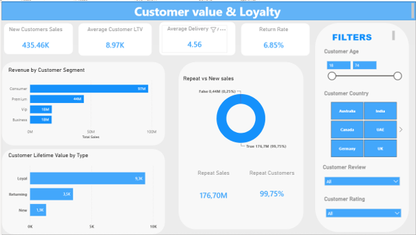
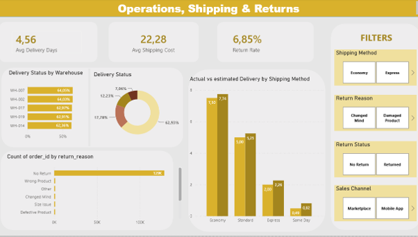
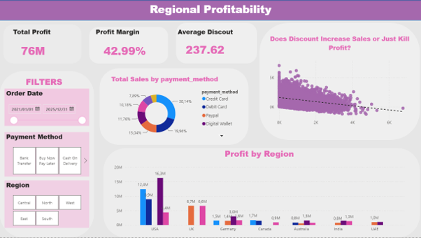

# E-Commerce-Sales-Analysis-Python-Power-BI
# E-Commerce Sales Analysis | Python + Power BI

End-to-end analysis of an e-commerce sales dataset (~138,000 orders, 46 columns). The raw data was downloaded from Kaggle, cleaned with **Python (pandas)**, and analysed in a four-page **Power BI** dashboard covering sales, customers, operations and regional profitability.

## Business questions

- How much are we selling, and how profitable is it? Is there a seasonal pattern?
- Which regions and payment methods bring in the most sales and profit?
- Do discounts increase sales, or just reduce profit?
- Who are our most valuable customers, and how many come back?
- Are we delivering on time, what does shipping cost, and what gets returned?

## Tools used

- **Python** (pandas, Jupyter Notebook): data cleaning and preparation
- **Power BI**: data modelling, DAX measures, interactive dashboard

## Data

- Source: Kaggle, *<https://www.kaggle.com/datasets/datascikhan/e-commerce-sales-and-customer-analytics?select=ecommerce_sales_customer_analytics_150k.csv>*
- Size: 138,116 orders and 46 columns (orders, customers, products, shipping, returns, reviews and marketing information)
- The dataset is not included in this repository because of its size. Download it from the Kaggle link above.

## Data cleaning (Python)

The full process is in [`notebooks/ecommerce_data_cleaning.ipynb`](notebooks/ecommerce_data_cleaning.ipynb). Main steps:

1. Inspected the data with `shape`, `info()`, `describe()` and missing-value counts.
2. Checked for duplicate `order_id` values (none found).
3. Handled missing values by group:
   - Delivery fields were missing for orders that were not delivered, so they were left as nulls instead of being filled with 0.
   - `return_status` and `return_reason` were filled with "No Return".
   - `campaign_name` and `coupon_code` were filled with "No Campaign" and "No Coupon".
   - Review fields were left empty for orders with no review.
4. Converted data types, such as `order_date` to datetime and postal codes to text, and invalid values were turned into nulls.
5. Cleaned text columns (stripped whitespace and standardised casing).

## Dashboard pages

| Page | What it shows |
|---|---|
| **Executive Overview** | Total sales, profit, margin and orders; sales and profit over time; region performance; discount impact |
| **Customer Value & Loyalty** | Revenue by customer segment, repeat vs. new customers, lifetime value, return rate |
| **Operations, Shipping & Returns** | Average delivery days, shipping cost, delivery status by warehouse, actual vs. estimated delivery by shipping method, returns |
| **Regional Profitability** | Profit and margin by region and country, sales by payment method, whether discounts help or hurt profit |

## Key findings

- Total sales of about **177.13M** and profit of about **76M**, a profit margin of roughly **43%**, across **138K orders**.
- Sales and profit show a clear **yearly peak** toward the end of each year.
- By region, the **South** leads in sales (56M), followed by Central (37M), West (35M), East (27M) and North (23M).
- The average delivery time is about **4.56 days**, average shipping cost about **22.28**, and the **return rate is 6.85%**.
- The discount impact chart shows profit margin falling as discounts increase.

## How to use
1. Download the dataset from Kaggle.
2. Run the notebook to produce the cleaned file.
3. Open the `.pbix` file in Power BI Desktop. If it asks for the data source, point it to your cleaned CSV.
